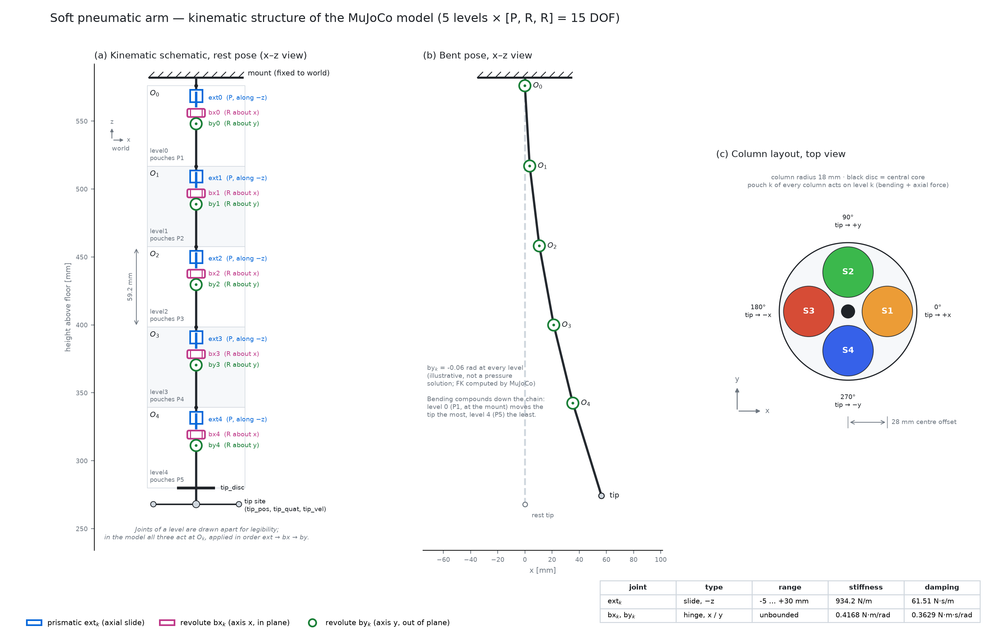

# soft-pneumatic-arm-control

RAS556 project: system identification and controller design for a four-segment,
twenty-pouch pneumatic soft robotic arm, simulated in MuJoCo via the
[`soft-robotic-arm`](https://pypi.org/project/soft-robotic-arm/) package
([source](https://github.com/Jeevan-HM/Soft-Robotic-Arm/tree/simulation/mujoco)).

Plan: identify a control-oriented model of the arm, start with a linear feedback
controller, then explore sliding mode control, and compare tracking accuracy and
robustness across reference trajectories.

## Setup

```bash
uv sync
```

## View the arm

```bash
uv run python scripts/view_arm.py                         # interactive MuJoCo viewer
uv run python scripts/view_arm.py --dump-xml soft_arm.xml  # write the generated MJCF
```

A separate slider window sets every pouch pressure (0–9 psi). Columns are
segments S1 (+x), S2 (+y), S3 (−x), S4 (−y); rows run from P1 at the mount down
to P5 nearest the tip, like the hanging arm. Each column's top slider sets all
five pouches of that segment.

## Kinematic diagram

```bash
uv run python scripts/draw_kinematics.py   # writes docs/figures/kinematic_diagram.{svg,png,pdf}
```


